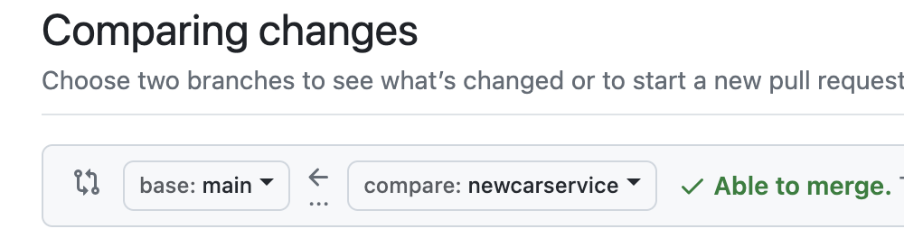
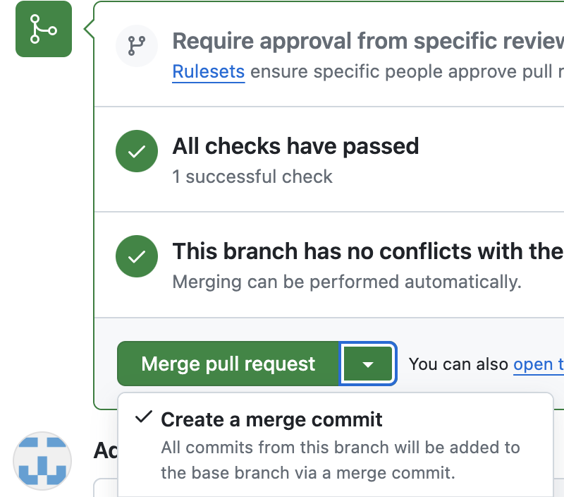

# Qualité de développement

Le but de ce cours est de faire des tests d'intégration au fur et à mesure que des nouveaux composants sont intégrés dans une apllication 
tout en vérifiant que les tests précédents continuent de passer sans relever d'erreur. 
On appelle cela des tests de non regression.

## Support de cours

https://drive.google.com/drive/folders/1RVLc4yg5IKTq3OSht6wm1Cdjq9jOLEqy?usp=sharing

# TD 1 - JUnit

JUnit est un framework de test unitaire pour le langage de programmation Java, créé par Kent Beck et Erich Gamma.

Etudier un exemple de classe de Test : https://junit.org/junit5/docs/current/user-guide/#writing-tests

Etudier l'utilisation des assertions : https://junit.org/junit5/docs/current/user-guide/#writing-tests-assertions

# TP 1 - JUnit

Créer un projet avec Intellij :


Attendre que le projet soit créé.

Ajouter la librairie Jupiter (clic droit sur le projet -> Open Module Settings) : 
- choisissez Maven pour que Intellij télécharge la librairie
- tapez jupiter dans la zone de rechercche


Ajouter dans src deux dossiers (main pour les classes à tester et test pour les classes de test).

Indiquer à Intellij que main est le dossier pour le code source et test celui pour les tests.


Créer un package (à votre nom par exemple) dans les deux dossiers main et test.

Créer une classe Voiture dans le package de src/main

Ajoutez à cette classe les attributs :
- une marque
- un prix

Ajouter des getters setters.

Créer une classe VoitureTest dans le package de src/test et écrivez à la norme JUnit le code de test de la classe Voiture.

Lancer le programme de test (clic droit sur la classe de test).

## Sauvegarde de votre projet dans un dépôt Git vous appartenant

Créer un projet PRIVE dans votre compte Github.

Poussez votre code vers votre dépôt git (en indiquant l'adresse de votre projet)

Ajoutez votre enseignant comme seul membre du projet.


Indiquez l'adresse de votre projet dans le fichier dépots git : https://drive.google.com/drive/folders/1RVLc4yg5IKTq3OSht6wm1Cdjq9jOLEqy?usp=sharing

## Codage d'une classe de service

Coder une classe de service à partir l'interface (implanter l'interface) : https://github.com/charroux/qualiteDeDeveloppement/blob/main/src/main/java/com/example/demo/service/Statistique.java

Ecrivez la classe de test.

## TP2 - Intégration continue ou Automatisation des tests lors des "pull requests"

Quand un développeur apporte une modification au code il faut tester que son code n'est pas buggé
et qu'il ne provoque pas d'erreur dans le code existant (tes de non regression du code). 
Pour ne pas corrompre le code existant, toute modification doit se faire dans une branche.
Le développeur en question pousser sa branche vers le serveur Git et à ce moment-là les tests 
(de son code et du code déjà écrit) doivent être déclenchés automatiquement côté serveur.
Si les tests réussissent, le chef de projet (ou une personne autorisée) pourra alors fusionner 
les branches et les autres développeurs pourront alors télécharger la dernière version du code. 
Cette procédure qui part de l'initiative du développeur et qui se termine par la fusion des branches si mes tests réussissent est appelée pull request.

### Github actions

Côté serveur, Github peut exécuter des tâches comme lancer les tests. Pour cela il faut configurer une action.

Créer un fichier appelé actions.yml dans un dossier .github/workflow (attention au . devant github)

Voilà un exemple d'un fichier d'action : 
https://github.com/charroux/qualiteDeDeveloppement/blob/main/.github/workflows/actions.yml

Etudiez ce fichier et adaptez-le à votre cas en ajustant le verion de Java (voir la doc https://github.com/actions/setup-java).

### Adaptation du projet à l'automatisation des tests

C'est l'outil Gradle qui est utilisé pour lancer les tests. Cependant, Gradle nécessite une adaptation du projet : 
- les fichiers sources doivent être placés dans src/main/java et non plus seulement src/main
- les programmes de tests doivent être placés dans src/test/java et non plus src/test
- le projet doit contenir des dossiers et fichiers propres à Gradle

#### Ajoutez les fichiers de configuration de Gradle

Une façon de récupérer les fichiers de configuration de Gradle est de créer un projet à la norme Gradle,
et de copier les fichiers de configuration vers votre projet.

vous pouvez créer un projet Gradle à partir du site : https://start.spring.io/

Puis téléchargez le projet.

Copiez ensuite les dossiers et fichiers suivants vers votre projet :
./gradle
build.gradle
gradle.properties
gradlew
gradlew.bat
settings.gradle 

Editez ce dernier fichier pour y indiquer le nom de votre projet.

### Créer une nouvelle version du code

Créer une branche, codez-y une nouvelle fonctionalité, puis poussez la branche vers Github avec : 

```
git push -u origin nomDeLaBranche
```

### Créer une pull request

Dans Github créer une pull request qui compare la version main avec celle de la nouvelle branche : 



Dès lors que la request est validée, l'action débute. Vous pouvez la suivre sur le site de Github.

Si l'action réussit, vous pourrez alors réaliser côté serveur la fusion de la nouvelle branche avec la branche main :



Tous les développeurs pourront ensuite récupérer sur leur machine la dernière version avec un git pull.


# TP3 Couverture de code

# TP4 Matrice de test

Etudiez la technique de la matrice de test dans le cours sur les tests : https://drive.google.com/drive/folders/1RVLc4yg5IKTq3OSht6wm1Cdjq9jOLEqy?usp=sharing

Etablir la matrice de tests.

Ajouter à votre projet les tests définis dans la matrice de tests.


