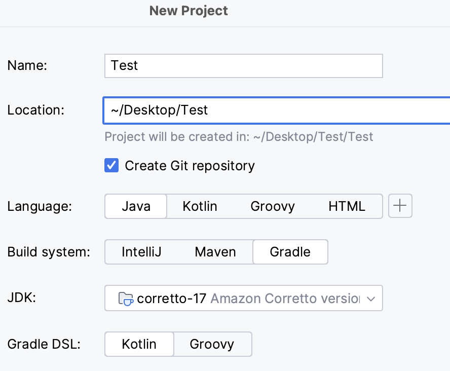
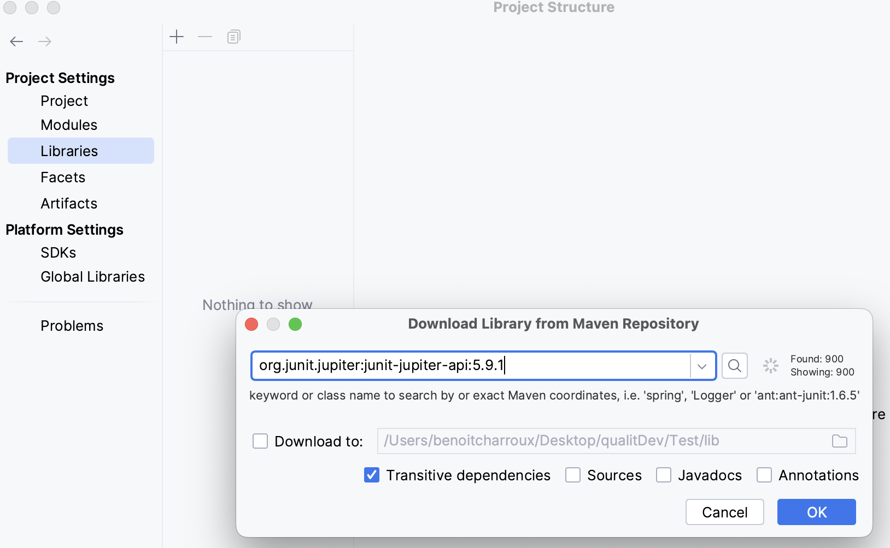
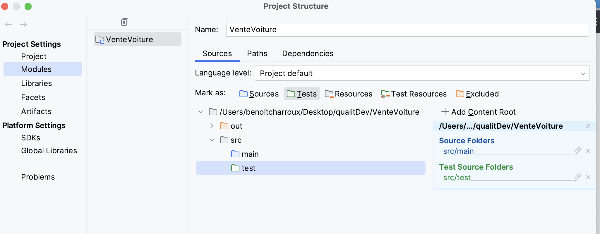
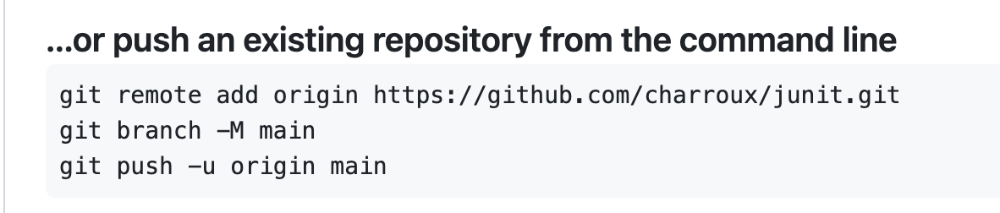

# Qualité de développement

Le but de ce cours est de faire des tests d'intégration au fur et à mesure que des nouveaux composants sont intégrés dans une apllication 
tout en vérifiant que les tests précédents continuent de passer sans relever d'erreur. 
On appelle cela des tests de non regression.

## Support de cours

https://drive.google.com/drive/folders/1RVLc4yg5IKTq3OSht6wm1Cdjq9jOLEqy?usp=sharing

# TD 1 - JUnit

JUnit est un framework de test unitaire pour le langage de programmation Java, créé par Kent Beck et Erich Gamma.

Etudier un exemple de classe de Test : https://junit.org/junit5/docs/current/user-guide/#writing-tests

Etudier l'utilisation des assertions : https://junit.org/junit5/docs/current/user-guide/#writing-tests-assertions

# TP 1 - JUnit

Créer un projet avec Intellij :

Attendre que le projet soit créé.

Ajouter la librairie Jupiter (clic droit sur le projet -> Open Module Settings) : 
- choisissez Maven pour que Intellij télécharge la librairie
- tapez jupiter dans la zone de rechercche

Ajouter dans src deux dossiers (main pour les classes à tester et test pour les classes de test).

Indiquer à Intellij que main est le dossier pour le code source et test celui pour les tests.

Créer un package (à votre nom par exemple) dans les deux dossiers main et test.

Créer une classe Voiture dans le package de src/main

Ajoutez à cette classe les attributs :
- une marque
- un prix

Créer une classe VoitureTest dans le package de src/test/Java et écrivez à la norme JUnit le code de test de la classe Voiture.

Lancer le programme de test (clic droit sur la classe de test).

## Sauvegarde de votre projet dans un dépôt Git vous appartenant

Créer un projet dans votre compte Github.

Poussez votre code vers votre dépôt git (en indiquant l'adresse de votre projet)

Indiquez l'adresse de votre projet dans le fichier dépots git : https://drive.google.com/drive/folders/1RVLc4yg5IKTq3OSht6wm1Cdjq9jOLEqy?usp=sharing

## Codage d'une classe de service

Coder une classe de service à partir l'interface (implanter l'interface: https://github.com/charroux/qualiteDeDeveloppement/blob/main/src/main/java/com/example/demo/service/Statistique.java

Ecrivez la classe de test.

# TP2 Matrice de test

Etudiez la technique de la matrice de test dans le cours sur les tests : https://drive.google.com/drive/folders/1RVLc4yg5IKTq3OSht6wm1Cdjq9jOLEqy?usp=sharing

Etablir la matrice de tests.

Ajouter à votre projet les tests définis dans la matrice de tests.

# TP3 Couverture de code

